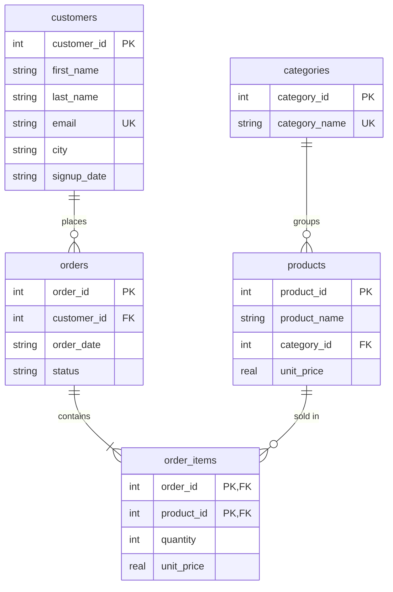

# Retail Database & Purchase Behavior Analysis

A relational database for a small retail store, plus SQL queries and a Python script that analyze how customers buy: revenue trends, best-selling products, repeat purchases, products bought together, and customer segments (RFM). It uses SQLite, which comes with Python, so there is nothing extra to install.

> **Note on data:** all data is synthetic. `generate_data.py` creates made-up customers, products, and orders with a fixed random seed. Nothing comes from a real store, so the numbers demonstrate the method and are not real business findings.

## Database Design
Five tables in third normal form (3NF). Each fact is stored once, and `order_items` keeps the price charged at the time of sale.



## Analysis (queries.sql)
| Query | Question it answers | SQL features |
|---|---|---|
| `monthly_revenue` | How do revenue, orders, and average order value change by month? | JOIN, GROUP BY, `strftime` |
| `top_products` | Which products earn the most? | `RANK()` window function |
| `category_share` | What share of revenue does each category bring? | Window `SUM() OVER ()` |
| `repeat_rate` | How many buyers come back? | CTE, `FILTER` |
| `days_between_orders` | How long between a customer's orders? | `LAG()`, `ROW_NUMBER()` for the median |
| `rfm` | Which customers are recent, frequent, high-spending? | CTEs, `NTILE()` |
| `bought_together` | Which products appear in the same order? | Self-join |
| `new_vs_returning` | How many customers each month are new vs returning? | CTE, `FILTER` |

`analysis.py` runs these queries, groups customers into four RFM segments (Champions, Recent low frequency, Loyal but slipping, Lapsed), saves charts and tables, and writes `outputs/findings.txt`.

## How to Run
You need Python 3 (the SQLite version must be 3.30 or newer, which is true for current Python releases).

```bash
git clone https://github.com/Moraytir/retail-db-analysis.git
cd retail-db-analysis

pip install -r requirements.txt
python build_db.py       # creates the synthetic data and retail.db
python analysis.py       # runs queries.sql, then saves charts and a summary
```

To explore the database yourself, open `retail.db` in a free tool such as [DB Browser for SQLite](https://sqlitebrowser.org/) and paste any query from `queries.sql`.

## Results
> Fill this section in after running the analysis, using `outputs/findings.txt`. Write only what the output shows.

- [Finding 1, e.g. which category earns the most revenue]
- [Finding 2, e.g. repeat purchase rate]
- [Finding 3, e.g. how much revenue comes from the best RFM segment]


## Tech Stack
SQL (SQLite), Python (Pandas, Matplotlib)

## Limitations
- Synthetic data, so patterns come from how the generator was written
- One year of history and no returns or discounts
- Simple rule-based RFM segments; other cut-offs would change the groups
- SQLite is used for easy setup; a few functions (`strftime`, `julianday`) are SQLite-specific and would change in PostgreSQL or MySQL
