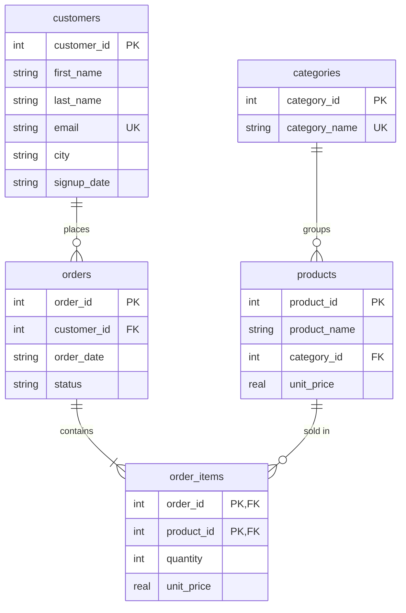
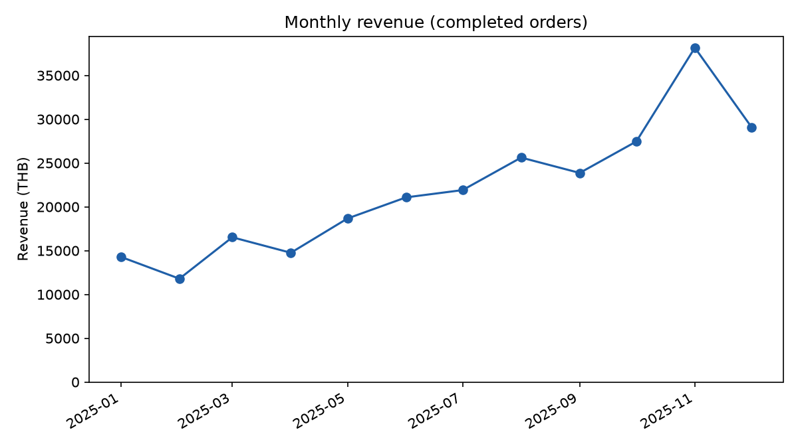
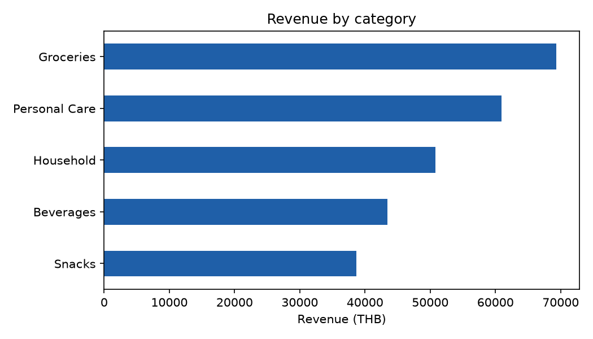
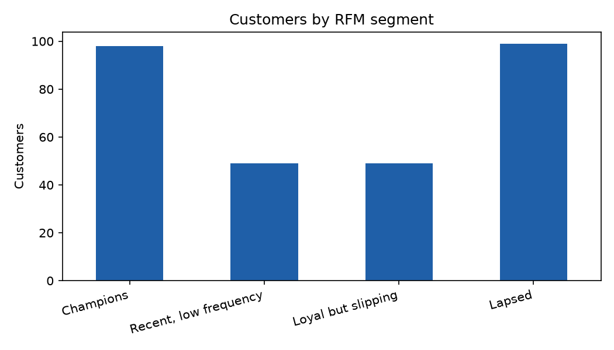
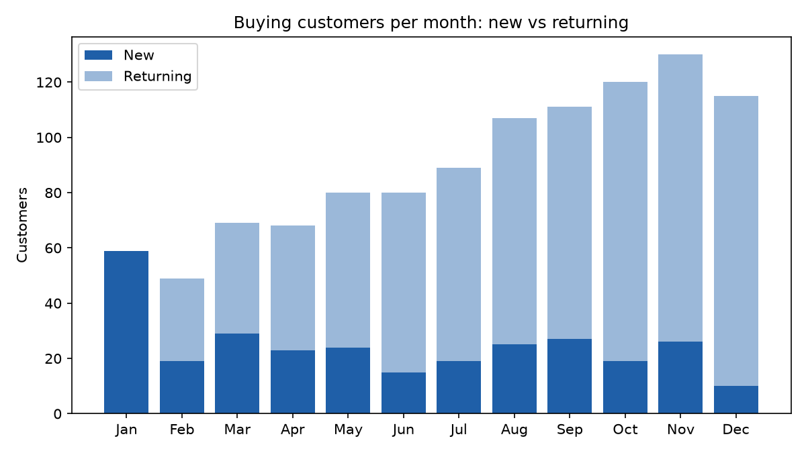

# Retail Database & Purchase Behavior Analysis

A relational database for a small retail store, plus SQL queries and a Python script that analyze how customers buy: revenue trends, best-selling products, repeat purchases, products bought together, and customer segments (RFM). It uses SQLite, which comes with Python, so there is nothing extra to install.

> **Note on data:** all data is synthetic. `generate_data.py` creates made-up customers, products, and orders with a fixed random seed. Nothing comes from a real store, so the numbers demonstrate the method and are not real business findings.

## Database Design
Five tables in third normal form (3NF). Each fact is stored once, and `order_items` keeps the price charged at the time of sale.



## Analysis (queries.sql)
| Query | Question it answers | SQL features |
|---|---|---|
| `monthly_revenue` | How do revenue, orders, and average order value change by month? | JOIN, GROUP BY, `strftime` |
| `top_products` | Which products earn the most? | `RANK()` window function |
| `category_share` | What share of revenue does each category bring? | Window `SUM() OVER ()` |
| `repeat_rate` | How many buyers come back? | CTE, `FILTER` |
| `days_between_orders` | How long between a customer's orders? | `LAG()`, `ROW_NUMBER()` for the median |
| `rfm` | Which customers are recent, frequent, high-spending? | CTEs, `NTILE()` |
| `bought_together` | Which products appear in the same order? | Self-join |
| `new_vs_returning` | How many customers each month are new vs returning? | CTE, `FILTER` |

`analysis.py` runs these queries, groups customers into four RFM segments (Champions, Recent low frequency, Loyal but slipping, Lapsed), saves charts and tables, and writes `outputs/findings.txt`.

## How to Run
You need Python 3 (the SQLite version must be 3.30 or newer, which is true for current Python releases).

```bash
git clone https://github.com/Moraytir/retail-sql.git
cd retail-sql

pip install -r requirements.txt
python build_db.py       # creates the synthetic data and retail.db
python analysis.py       # runs queries.sql, then saves charts and a summary
```

To explore the database yourself, open `retail.db` in a free tool such as [DB Browser for SQLite](https://sqlitebrowser.org/) and paste any query from `queries.sql`.

## Results
Numbers from running the analysis on the synthetic dataset (2,089 orders, 300 customers, 2025).

- **Revenue:** 263,217 THB from 2,012 completed orders, with an average order value of 130.8 THB. Monthly revenue ranged from 11,796 THB (February) to 38,159 THB (November). The rise over the year mostly reflects how the generator adds new customers over time.
- **Categories:** Groceries earns the most, at 26.4% of revenue.
- **Repeat purchases:** 84.1% of buyers ordered at least twice (248 of 295). The average gap between orders is 22.2 days but the median is 11.0, so a few long gaps pull the average up.
- **Products bought together:** Cola + Instant Noodle Cup is the most common pair (55 orders). The generator makes beverages and snacks more likely to share a basket, so this shows the query works rather than a real shopping habit.
- **Customer segments (RFM):** Champions are 98 of 295 customers (about a third) but bring 57.4% of revenue. Loyal but slipping customers (49) bring 24.4%, Lapsed customers (99) bring 11.0%, and Recent low-frequency customers (49) bring 7.3%.






Because the data is synthetic, these results show what the analysis produces, not how a real store behaves.

## Tech Stack
SQL (SQLite), Python (Pandas, Matplotlib)

## Limitations
- Synthetic data, so patterns come from how the generator was written
- One year of history and no returns or discounts
- Simple rule-based RFM segments; other cut-offs would change the groups
- SQLite is used for easy setup; a few functions (`strftime`, `julianday`) are SQLite-specific and would change in PostgreSQL or MySQL
